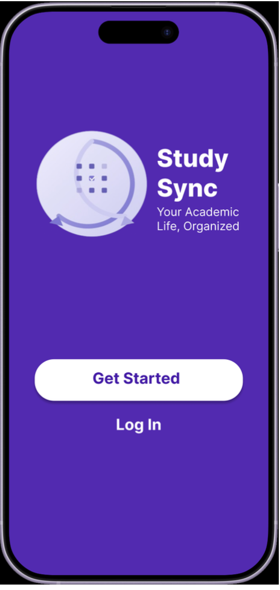
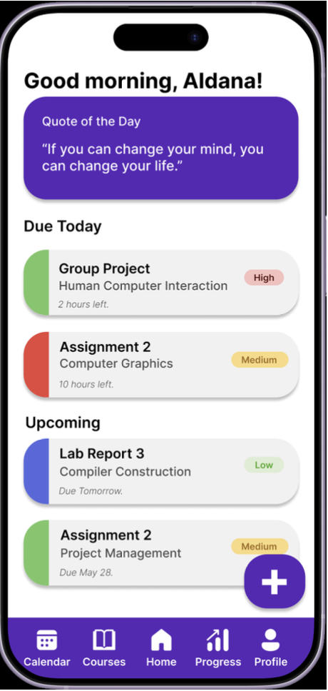
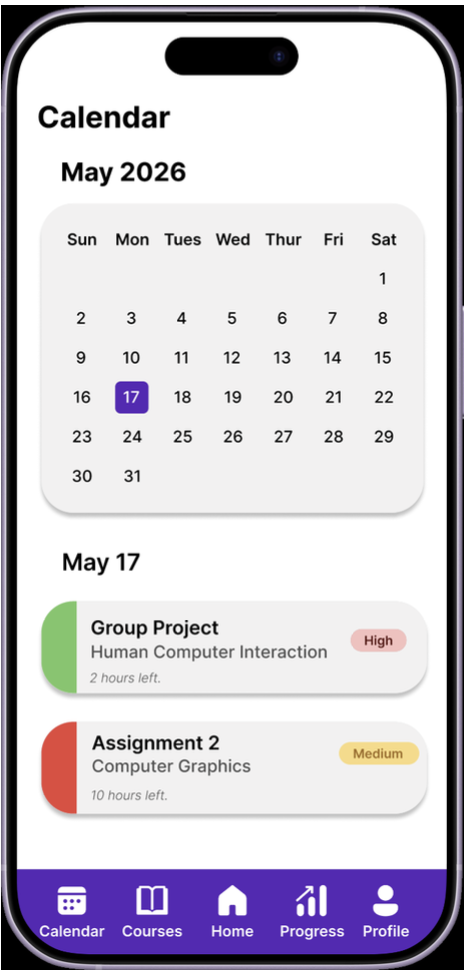

# StudySync — Your Academic Life, Organised

A mobile application designed to help university students manage courses, track assignments, and never miss a deadline.

> CPCS-381: Human Computer Interaction | King Abdulaziz University  
> Supervisor: Dr. Nouf AlKhudair | By: Relam Abbas AlOrri | May 2026

---

## The Problem

University students juggle multiple courses, assignments, exams, and projects simultaneously. Existing tools are either too generic (Google Calendar, Notion) or too rigid (Blackboard) — none are built specifically for academic task management on mobile.

## The Solution

StudySync is an iOS and Android mobile app that centralizes all academic responsibilities into one clean, student-friendly interface.

### Core Features

| Feature | Description |
|---|---|
| Course Management | Add courses with unique color labels for visual organization |
| Task Dashboard | Prioritized home screen showing due today and upcoming tasks |
| Calendar View | Weekly and monthly view of all academic deadlines |
| Smart Notifications | Push reminders for upcoming assignments and deadlines |
| Progress Tracking | Visual progress per course with motivational feedback |
| Shared Rental Option | Quick task creation in under 2 minutes |

---

## Prototype

Built in Figma — view the interactive prototype here:  
[StudySync Figma Prototype]([https://www.figma.com/proto/7U2Ft6dZAuoDcKXFYrtBea/Cpcs381_Project?node-id=18-8&p=f&t=ONel9kgusJL8AidV-0&scaling=scale-down&content-scaling=fixed&page-id=0%3A1&starting-point-node-id=4%3A33&show-proto-sidebar=1](https://www.figma.com/design/7U2Ft6dZAuoDcKXFYrtBea/Group13_Cpcs381_Project?m=auto&t=mhJ3BkVF4Vuu5uzB-1))

### Screens Preview

| Launch | Dashboard | Calendar |
|---|---|---|
|  |  |  |

---

## Research & Validation

A questionnaire was conducted with 11 university students:

- **81.8%** currently use productivity tools but are unsatisfied
- **54.5%** said forgetting deadlines is their biggest challenge
- **91.8%** preferred simple clean design as the top feature
- **72.7%** wanted better reminders and notifications

---

## Documentation

| File | Contents |
|---|---|
| `docs/requirements.md` | Interface requirements and user needs |
| `docs/design-principles.md` | HCI design principles applied |
| `docs/evaluation.md` | Usability testing results and analysis |
| `report/` | Full project report PDF |

---

## Tools Used

Figma · Google Forms · Human-Centered Design Methodology
